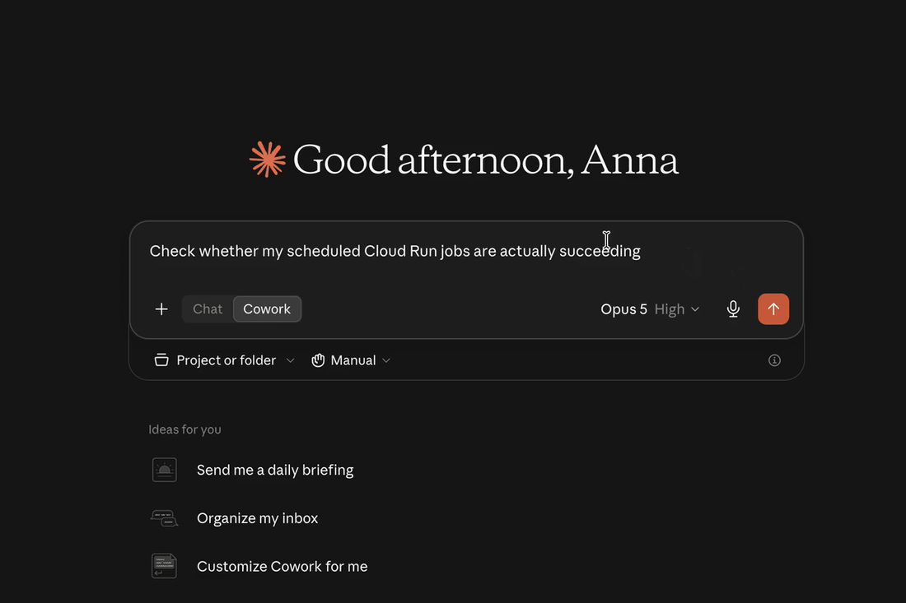

# Aura Tracker GCP

[](https://github.com/asbrodova/aura-tracker-gcp/actions/workflows/ci.yaml)
[](https://github.com/asbrodova/aura-tracker-gcp/releases/latest)
[](LICENSE)

**The open-source intelligence layer for Google Cloud.**

Ask a question in plain English. Aura investigates live GCP inventory, metrics, logs, IAM, topology, recommendations, and billing data—then returns a prioritized answer with evidence.

Aura is an open-source, model-agnostic GCP intelligence engine. It combines live cloud access with deterministic investigation workflows for incidents, security, architecture, environment drift, and cost.

Claude Desktop, Claude Code, Cowork, and other AI clients connect to Aura through [Model Context Protocol (MCP)](https://modelcontextprotocol.io).

**73 tools · 30 modules · 10 resources · multi-environment routing · preview-before-change safety**



**[Install in five minutes](#quick-start)** · **[Try real questions](#questions-worth-asking)** · **[Read the wiki](https://github.com/asbrodova/aura-tracker-gcp/wiki)** · **[View releases](https://github.com/asbrodova/aura-tracker-gcp/releases)**

> If Aura saves you a round of console-hopping, consider [starring the repository](https://github.com/asbrodova/aura-tracker-gcp). It helps other GCP engineers discover the project.

## One question. One investigation. One useful answer.

GCP incidents rarely live inside one product page. A failed scheduled workload may require Cloud Scheduler, Cloud Run Jobs, execution history, and Logging. A cost increase may require billing exports, Asset Inventory, Monitoring, and Recommender.

Aura follows those relationships for you.

| Ask | Aura investigates | You get |
|---|---|---|
| “Are my scheduled Cloud Run jobs actually succeeding?” | Scheduler → Cloud Run Jobs → executions → logs | The failing job, failed runs, root cause, and what is still healthy |
| “Why did preprod cost more last week?” | Correct environment → billing export → service/SKU/resource deltas → assets → recommendations | Ranked cost drivers, new resources, rate/usage effects, and savings opportunities |
| “Is this project secure?” | IAM inheritance and deny policies → service accounts → secrets metadata → public endpoints → firewalls → GKE identity | A severity-ranked audit, security score, remediation, and explicit coverage gaps |
| “What changed between dev and preprod?” | Symmetric collection across supported services | Field-level drift without silently treating either environment as the baseline |
| “Show me how this system is connected.” | Runtime inventory → topology → dependencies | Mermaid, Graphviz DOT, JSON, or rendered SVG architecture output |

## Why engineers use Aura

### It reasons across services

Aura is not a collection of thin `list` wrappers. Its higher-level workflows correlate evidence across GKE, Cloud Run, Scheduler, Eventarc, Pub/Sub, Monitoring, Logging, IAM, Cloud SQL, networking, billing, and more.

### It starts with the problem, not the product page

Ask naturally. You do not need to know the tool name, API filter, resource URI, or which GCP console page contains the next clue.

### It understands environments

Configure aliases such as `dev`, `preprod`, and `prod`, choose one default, and address any environment explicitly. Aura uses aliases in responses so project IDs do not need to leak into model context.

### It explains spend—not only totals

The opt-in cost engine compares complete calendar windows, reconciles cost deltas, finds new billable resources, separates usage and rate effects, checks traffic evidence, and adds idle-resource recommendations. Each environment can route to its own billing export and BigQuery query project.

### It is safe to explore

71 of the 73 default tools are read-only. The two infrastructure-changing tools—GKE node-pool scaling and Cloud Run traffic updates—use expiring, single-use preview plans when safety is enabled. Secret Manager integration reads metadata only; secret values are never accessed.

### It stays yours

The engine is Apache-2.0 licensed, uses your Application Default Credentials, and can run locally over stdio or as a protected team service over SSE. Choose the model and MCP client that fit your workflow.

## Quick start

### 1. Install

Homebrew is the fastest path on macOS and Linux:

```bash
brew install --cask asbrodova/tap/aura-tracker-gcp
```

You can also download a binary from the [latest release](https://github.com/asbrodova/aura-tracker-gcp/releases/latest), install with Go, or run the published container.

```bash
go install github.com/asbrodova/aura-tracker-gcp/cmd/aura-tracker-gcp@latest
```

### 2. Authenticate

Aura uses Google Cloud Application Default Credentials. It does not need a credential embedded in the MCP configuration.

```bash
gcloud auth application-default login
```

For teams, prefer service-account impersonation, Workload Identity, or an attached service account. The [service-account setup guide](https://github.com/asbrodova/aura-tracker-gcp/wiki/Getting-Started#use-a-service-account) provides least-privilege roles by module.

### 3. Add Aura to your MCP client

Find the installed binary:

```bash
which aura-tracker-gcp
```

Use that exact path in your client configuration. On an Apple Silicon Mac it is normally `/opt/homebrew/bin/aura-tracker-gcp`.

```json
{
  "mcpServers": {
    "aura-tracker-gcp": {
      "command": "/opt/homebrew/bin/aura-tracker-gcp",
      "env": {
        "GCP_PROJECT_ID": "your-gcp-project-id"
      }
    }
  }
}
```

Common configuration locations:

- Claude Desktop on macOS: `~/Library/Application Support/Claude/claude_desktop_config.json`
- Claude Code: `.claude/settings.json` or `~/.claude/settings.json`
- Other clients: point the MCP stdio server at the Aura binary

Restart the client after saving the file.

### 4. Ask one useful question

Start with something real:

> Check whether my scheduled Cloud Run jobs are actually succeeding.

Or ask for a wider view:

> Give me a quick Aura check for dev. Show me what is healthy, what is not, and what I should look at first.

Aura will use the default full tool surface. You only need `--modules` when you intentionally want to reduce client context or limit GCP connections.

> [!IMPORTANT]
> Aura’s Recommender integration is on at runtime by default, but that does **not** enable the Google Cloud Recommender API or grant IAM access. Enable `recommender.googleapis.com` and grant `roles/recommender.viewer` separately in every configured project. See [Recommender setup](https://github.com/asbrodova/aura-tracker-gcp/wiki/Configure-Your-Environment#environment-variables).

### macOS Gatekeeper

If macOS blocks the downloaded binary on first run, use **System Settings → Privacy & Security → Allow Anyway**, or run:

```bash
xattr -d com.apple.quarantine "$(which aura-tracker-gcp)"
```

Then restart the MCP client.

## Questions worth asking

These are deliberately written like real engineering questions, not API calls.

### Reliability and incident response

> Production is failing. Correlate recent deployments, 5xx errors, latency, logs, dependencies, and infrastructure changes. Rank the likely causes and show the evidence.

> Are any GKE clusters or node pools showing bottlenecks, version drift, or autoscaling problems?

> Which Pub/Sub subscriptions are building backlog, and what downstream services consume them?

> Check whether my scheduled Cloud Run jobs are actually succeeding.

### Security and access

> Audit dev for the most important security gaps. Prioritize what I should fix first and tell me what you could not verify.

> Which services are publicly reachable, and is that exposure consistent with IAM and firewall configuration?

> What can the current identity inspect in this project, and which Aura checks will fail because of missing permissions?

### Cost and efficiency

> Why did GCP costs increase in preprod during the last seven complete days? Show the biggest drivers and evidence.

> Which resources appeared for the first time this month, and how much did they cost?

> Find idle or over-provisioned resources and estimate the available monthly savings.

### Architecture and drift

> Compare dev and preprod. Show only differences that could cause incidents or unexpected cost.

> Generate a Mermaid architecture diagram for the serverless request path from Eventarc through Cloud Run and Pub/Sub.

> Show the dependencies around this Cloud Run service, including data stores, queues, secrets, and networking.

## Multi-environment GCP intelligence

For teams, put project selection in `~/.aura-tracker.yaml` instead of duplicating MCP server definitions:

```yaml
environments:
  - project_id: my-company-dev
    alias: dev
    default: true
  - project_id: my-company-preprod
    alias: preprod
```

The behavior is predictable:

- “Check Cloud Run errors” uses `dev`, because it is the default.
- “Check Cloud Run errors in preprod” uses the preprod project.
- “Compare dev and preprod” performs one symmetric drift comparison.
- Results, errors, resources, prompts, and diagrams use aliases instead of configured project IDs.
- Aliases are case-insensitive; configured project IDs are also accepted as selectors.

Multi-environment collection covers BigQuery, Cloud Run, Cloud SQL, data stores, Eventarc, Cloud Functions, GKE clusters and workloads, IAM service accounts, Monitoring, networking, Pub/Sub, Scheduler, Secret Manager, Storage, supply chain, Cloud Tasks, VPC Access, and Workflows.

Read the full [environment configuration](https://github.com/asbrodova/aura-tracker-gcp/wiki/Configure-Your-Environment) and [drift detection](https://github.com/asbrodova/aura-tracker-gcp/wiki/Drift-Detection) guides.

## Cost reasoning for dev, preprod, and prod

Cost reasoning is opt-in because it executes chargeable BigQuery queries against the Cloud Billing detailed usage export. Aura dry-runs every statement first, enforces a maximum-bytes-billed limit, and caches results for 15 minutes.

Each environment can use a separate export:

```yaml
environments:
  - project_id: my-company-dev
    alias: dev
    default: true
  - project_id: my-company-preprod
    alias: preprod

cost_reasoning:
  enabled: true
  timezone: UTC
  history_days: 90
  max_bytes_billed: 5368709120
  sources:
    - environments: [dev]
      query_project_id: finops-dev
      export_project_id: billing-dev
      dataset: cloud_billing
    - environments: [preprod]
      query_project_id: finops-preprod
      export_project_id: billing-preprod
      dataset: cloud_billing
```

`query_project_id` owns the BigQuery query jobs and their query charges. It may be the same project as `dev`, `preprod`, or a central FinOps project. `export_project_id` contains the detailed billing-export dataset.

One central export is also supported: assign `environments: [dev, preprod]` to one source. Aura still filters billing rows by the selected workload project, so results never silently mix environments.

If the question does not name an environment, Aura analyzes the default (`dev` above) and says so. If the question names `preprod`, Aura selects the preprod project and its mapped billing source and labels the answer as preprod. It never falls back to another environment’s billing source.

See [Cost Reasoning](https://github.com/asbrodova/aura-tracker-gcp/wiki/Cost-Reasoning) for billing export setup, IAM, attribution limits, query bounds, and complete configuration examples.

## What Aura covers

| Intelligence area | Capabilities |
|---|---|
| **Health and incidents** | Production diagnosis, Aura Score, GKE bottlenecks, Cloud Run health and jobs, logs, metrics, traces, alerting, uptime checks, SLOs, and observability coverage |
| **Security** | Project security posture, inherited IAM and deny policies, service accounts and keys, public endpoints, firewalls, Workload Identity mappings, secrets metadata, and permission testing |
| **Architecture** | Cross-service topology, serverless event graph, architecture export, scoped Mermaid/Graphviz/SVG diagrams, GKE workloads and mesh, load balancers, API Gateway, VPC, subnets, NEGs, and PSC |
| **Cost** | Recommender signals, composite health/efficiency scores, detailed billing-export reasoning, new-resource confirmation, traffic correlation, and BigQuery optimization prompts |
| **Environment control** | Aliases, default routing, project-ID masking, symmetric drift detection, and per-environment cost-source routing |
| **Platform inventory** | Cloud Functions, Eventarc, Scheduler, Workflows, Tasks, Pub/Sub, Cloud SQL, Storage, Spanner, AlloyDB, Firestore, Memorystore, Artifact Registry, Cloud Build, and Service Directory |
| **Safe changes** | Preview-and-confirm GKE node-pool scaling and Cloud Run traffic updates |

The default server exposes 73 tools across 30 module flags. Cost reasoning and recommendation export are separately controlled integrations. Four static and six templated MCP resources expose BigQuery schemas, Cloud Run snapshots, Storage metadata, and IAM permissions before the model chooses a tool.

Browse the complete [module reference](https://github.com/asbrodova/aura-tracker-gcp/wiki/Module-Reference), [resource reference](https://github.com/asbrodova/aura-tracker-gcp/wiki/MCP-Resources-Reference), and [built-in workflows](https://github.com/asbrodova/aura-tracker-gcp/wiki/Built-in-Prompts-and-Workflows).

## Aura Score

Aura Score turns raw signals into a 0–100 view of health and efficiency. It can score individual Cloud Run services, Cloud SQL instances, BigQuery datasets, GKE clusters, and Cloud Storage buckets, or summarize a project worst-first.

```text
🔴 Cloud SQL: legacy-db     | Aura: 28  (Idle resource)
🟡 Cloud Run: api-gateway   | Aura: 62  (Healthy, over-provisioned)
🟢 Cloud Run: auth-service  | Aura: 91  (Healthy and scaled)
```

The response includes the individual health and efficiency signals, evidence, and concrete reasons behind the score. Recommender results are cached for 12 hours and quota gaps are reported rather than disguised as clean health.

See the [scoring model and signal weights](https://github.com/asbrodova/aura-tracker-gcp/wiki/Aura-Score).

## Safety and privacy by design

| Control | Default | Behavior |
|---|---|---|
| Read-only tools | 71 of 73 base tools | Inventory, investigation, audits, diagrams, drift, and recommendations do not mutate infrastructure |
| Mutation safety | On | Dry-run returns an immutable plan; confirmation requires its expiring, single-use `plan_id` |
| Recommender runtime integration | On | The Google API and `roles/recommender.viewer` must still be enabled per project |
| Cost reasoning | Off | Must be explicitly enabled and configured with billing-export sources |
| PII and credential scrubbing | Off | Optional local anonymization can scrub every tool, resource, prompt, error, and diagram response |
| Secret values | Never accessed | Secret Manager exposes metadata only and never calls the versions-access API |
| Remote SSE access | Authenticated | Public endpoints require HTTPS, Google identity tokens, and an email allowlist unless explicitly broadened |

Mutation plans expire after 10 minutes and are single-use. Confirmed executions are audit-logged. The protocol enforces a separate preview and confirmation call; whether a distinct human approves the second call depends on the MCP client and deployment policy.

Read the full [security model](https://github.com/asbrodova/aura-tracker-gcp/wiki/Security-and-Safety) and [safety and cost safeguards](https://github.com/asbrodova/aura-tracker-gcp/wiki/Safety-and-Cost-Safeguards).

## Run only what you need

Omit `--modules` to load the default full toolkit. For smaller client context and fewer GCP client connections, select modules explicitly:

```json
{
  "mcpServers": {
    "aura-tracker-gcp": {
      "command": "/opt/homebrew/bin/aura-tracker-gcp",
      "args": ["--modules=incident,security,drift"],
      "env": {
        "GCP_PROJECT_ID": "your-gcp-project-id"
      }
    }
  }
}
```

Useful focused setups:

| Goal | Modules |
|---|---|
| One-call production diagnosis | `incident` |
| Project security audit | `security` |
| Environment comparison | `drift` |
| GKE investigation | `gke,gke_workloads,gke_mesh,aura,monitoring,logging` |
| Serverless investigation | `cloudrun,functions,eventarc,scheduler,pubsub,serverlessgraph,monitoring,logging` |
| Architecture discovery | `archgraph,topology,networking,serverlessgraph` |
| Historical cost explanation | `cost` plus `cost_reasoning.enabled: true` |

## Local engine today. Managed platform next.

Aura Tracker GCP is the open-source engine: auditable, self-hostable, model-agnostic, and useful without a hosted account.

The long-term direction is **Aura Cloud**—a managed UI and team experience built on the same engine, with simpler onboarding, multi-project workspaces, saved investigations, scheduled checks, history, alerts, collaboration, and governance.

The open-source engine is not a teaser. It is the foundation. You should be able to keep using it locally or self-hosted even as managed capabilities grow around it.

If you would use a managed Aura experience, [open an issue and describe your workflow](https://github.com/asbrodova/aura-tracker-gcp/issues/new). Real platform-engineering use cases will shape what is built first.

## Documentation

| Start here | Guide |
|---|---|
| Install, authenticate, and configure IAM | [Getting Started](https://github.com/asbrodova/aura-tracker-gcp/wiki/Getting-Started) |
| Configure one or many environments | [Configure Your Environment](https://github.com/asbrodova/aura-tracker-gcp/wiki/Configure-Your-Environment) |
| Understand every module | [Module Reference](https://github.com/asbrodova/aura-tracker-gcp/wiki/Module-Reference) |
| Diagnose incidents | [Incident Diagnosis](https://github.com/asbrodova/aura-tracker-gcp/wiki/Incident-Diagnosis) |
| Audit security posture | [Security Posture](https://github.com/asbrodova/aura-tracker-gcp/wiki/Security-Posture) |
| Explain cost changes | [Cost Reasoning](https://github.com/asbrodova/aura-tracker-gcp/wiki/Cost-Reasoning) |
| Compare environments | [Drift Detection](https://github.com/asbrodova/aura-tracker-gcp/wiki/Drift-Detection) |
| Generate architecture diagrams | [Automatic Architecture Diagrams](https://github.com/asbrodova/aura-tracker-gcp/wiki/Automatic-Architecture-Diagrams) |
| Review safety and privacy | [Security and Safety](https://github.com/asbrodova/aura-tracker-gcp/wiki/Security-and-Safety) |
| Contribute a new tool or module | [Architecture and Contributing](https://github.com/asbrodova/aura-tracker-gcp/wiki/Architecture-and-Contributing) |

## Contributing

Contributions are welcome—especially new GCP intelligence workflows, collectors, tests, documentation, and real-world investigation prompts.

```bash
git clone https://github.com/asbrodova/aura-tracker-gcp.git
cd aura-tracker-gcp
make build
make test
make smoke
```

Before opening a PR, read [CONTRIBUTING.md](CONTRIBUTING.md). The project uses a hexagonal architecture boundary, structured MCP errors, module-scoped IAM, and tests for every registered tool.

Not ready to contribute code? You can still help:

- [Star the repository](https://github.com/asbrodova/aura-tracker-gcp) so more GCP engineers can find it.
- [Watch releases](https://github.com/asbrodova/aura-tracker-gcp/subscription) for new intelligence workflows.
- [Open an issue](https://github.com/asbrodova/aura-tracker-gcp/issues/new) with a real question Aura should answer.
- Share a successful prompt or anonymized investigation with the community.

Aura Tracker GCP is created and maintained by [Anna Sbrodova](https://github.com/asbrodova), building practical open-source GCP intelligence in public.

## License

Aura Tracker GCP is licensed under the [Apache License 2.0](LICENSE).

---

**Ask your cloud a question. Get evidence—not another dashboard.**
